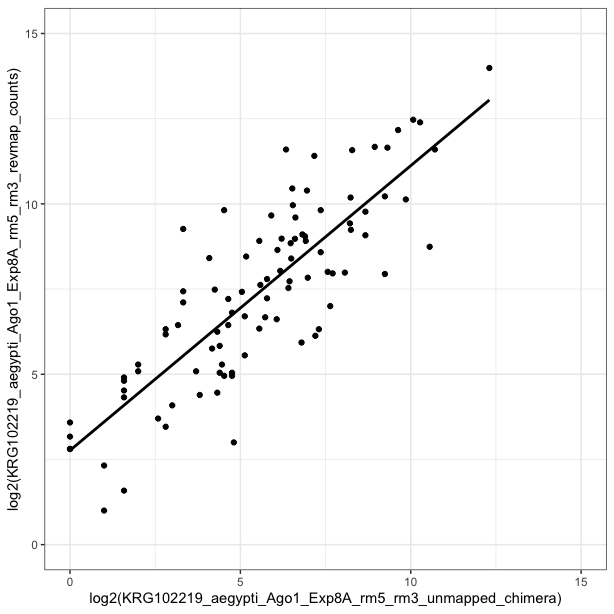

```r
baseDir <- "/Users/kathryn/Reprocess_all_paper_datasets/test_chimera_vignette"
library(CLIPflexR)
library(dplyr)
library(stringr)
library(ggplot2)
```

## Process AGO-CLIP reads to find small RNAs directing AGO targeting

This vignette demonstrates how chimeric reads can be detected. Chimeras are reads  containing a both a small RNA sequence and its transcript target sequence, indicating that the small RNA was targeting AGO to the transcript. This analysis could be applied to other RBPs if applicable... 


Modified from [Scheel et al., *Cell Host Microbe*, 2016](https://www.ncbi.nlm.nih.gov/pmc/articles/PMC4826034/)

## Chimera processing

Returns BED file for each sample containing the genomic coordinates of the transcript target, name of the read and of the small RNA found in that read, score (0; meaningless in this context), and strand of genomic target 

### Chimera processing starting from bams

This is the standard, recommended pipeline for chimera processing using [chimera_Process](../reference/chimera_Process.html).  

Follow this pipeline if you have mapped your reads to your genome using CLIPflexR **bowtie_align** "genome_map" mode (see [bowtie_align documentation](../reference/bowtie_align.html)) or another aligner that disallows soft clipping. When soft clipping is not allowed, chimeric reads should not map to your genome.  

Please note, if you have mapped your reads to your genome allowing soft-clipping, you should perform your chimera analysis on all reads prior to mapping, by setting chimera_Process **bams** = NULL and setting **fastas** to your fasta file path(s); see **chimera processing starting from fastas**.

We will use 2 bams generated in the CLIPflexR [*Processing reads, mapping, and building a count matrix vignette*](../articles/Processing_to_matrix.html), with AGO1-CLIP reads from mosquitoes mapped to the AaegL5 genome assembly.  

First, chimera_Process extracts unmapped reads from bams mapped to the genome using [extract_unmapped](../reference/extract_unmapped.html). Then, chimera_Process makes indices of unmapped reads and aligns known small RNA sequences to reads using [bowtie2_index](../reference/bowtie2_index.html) and [bowtie_align](../reference/bowtie_align.html) in "reverse_map" mode . These bams are converted to beds with the reads that contained small RNAs and the positions of the small RNAs in the read sequence using [bamtobed](../reference/bamtobed.html) and then the read sequences are merged with the read names. This modified BED is then chimera processed to obtain fastas of transcript target sequences downstream of the small RNA. Options are **remove_dups**: remove multiple small RNAs mapping to the same read, TRUE (default) or FALSE. When TRUE, known miRNAs will be prioritized and known miRNA names must be in the format "miR-", "let-", "bantam-", "iab-".); **exclude**: names of small RNAs to remove, default is NULL, can be set to character vector to specify; must match names in knownMiRNAs file. Finally, processed transcript read sequences that contained a small RNA sequence are remapped to the genome using [bowtie_align](../reference/bowtie_align.html) in "genome_map" mode; genome index is set with **genomeIndex**: path to genome index. Bams are then converted to beds using [bamtobed](../reference/bamtobed.html).


```r
#define the path to your bam files 
bams <- dir(baseDir, pattern = "*rm5_rm3.bam$", full.names = TRUE)
bams
```

```
## [1] "/Users/kathryn/Reprocess_all_paper_datasets/test_chimera_vignette/KRG102219_Aag2_Ago1_Exp8A_rm5_rm3.bam"
## [2] "/Users/kathryn/Reprocess_all_paper_datasets/test_chimera_vignette/KRG102219_Aag2_Ago1_Exp8B_rm5_rm3.bam"
```

```r
#path to aegypti miRNAs
miRNAs <- dir(baseDir, pattern = "*miRNAs*", full.names = TRUE)
miRNAs
```

```
## [1] "/Users/kathryn/Reprocess_all_paper_datasets/test_chimera_vignette/aae_miRNAs_mature.fa"
```

```r
myIndex <- "/Users/kathryn/Bowtie_indices/AaegL5/Aedes-aegypti-LVP_AGWG_CHROMOSOMES_AaegL5"
myIndex
```

```
## [1] "/Users/kathryn/Bowtie_indices/AaegL5/Aedes-aegypti-LVP_AGWG_CHROMOSOMES_AaegL5"
```

```r
chimera_beds <- lapply(bams, chimera_Process, knownMiRNAs = miRNAs, genomeIndex = myIndex, overwrite=TRUE, verbose = TRUE, fastas=NULL)
```

```
## Extracting unmapped reads to FASTA...done
## Creating indices from FASTA files...done
## Mapping miRNAs to unmapped reads...done
## Converting BAMs to BEDs...done
## Checking read names...read names ok
## Merging reads with mapped small RNAs to read sequences...done
## Writing merged output files...done
## Extracting read sequences up- and downstream of small RNA sequences & writing output files...done
## Writing downstream sequences as fastas...done
## Remapping downstream sequences to genome...done
## Converting remapped BAMs to BEDs...done
## Extracting unmapped reads to FASTA...done
## Creating indices from FASTA files...done
## Mapping miRNAs to unmapped reads...done
## Converting BAMs to BEDs...done
## Checking read names...read names ok
## Merging reads with mapped small RNAs to read sequences...done
## Writing merged output files...done
## Extracting read sequences up- and downstream of small RNA sequences & writing output files...done
## Writing downstream sequences as fastas...done
## Remapping downstream sequences to genome...done
## Converting remapped BAMs to BEDs...done
```

```r
chimera_beds <- unlist(chimera_beds)
chimera_beds 
```

```
## [1] "/Users/kathryn/Reprocess_all_paper_datasets/test_chimera_vignette/KRG102219_Aag2_Ago1_Exp8A_rm5_rm3_unmapped_chimera.txt.bed"
## [2] "/Users/kathryn/Reprocess_all_paper_datasets/test_chimera_vignette/KRG102219_Aag2_Ago1_Exp8B_rm5_rm3_unmapped_chimera.txt.bed"
```

```r
example <- read.delim(chimera_beds[1], header = F, sep = "\t")
head(example)
```

```
##   V1     V2     V3                                                   V4 V5
## 1  2  58305  58331  5853555-1#CAAAAGAGGGAGGACGATGCGGAAATA;aae-miR-12-5p  0
## 2  2  58767  58792 7970082-1#CAAAAGAGGGAGGACGATGCGGCGCGA;aae-miR-305-5p  0
## 3  2 317871 317893 5049561-1#CAAAAAAGGGAGGACGATGCGGTTACG;aae-miR-92b-3p  0
## 4  2 339105 339132  1163777-1#CAAAAGAGGGAGGACGATGCGGCAAGG;aae-miR-71-3p  0
## 5  2 364900 364927    5192115-1#CAAAAGAGGGAGGACGATGCGGTCAGT;aae-miR-184  0
## 6  2 406290 406318    6971802-1#CAAAAGAGGGAGGACGATGCGGTAGGT;aae-miR-996  0
##   V6
## 1  +
## 2  +
## 3  +
## 4  +
## 5  +
## 6  +
```

```r
nrow(example)
```

```
## [1] 6678
```

We can exclude certain miRNAs from analysis setting the **exclude** to a character vector containing names of miRNAs to be exlcuded, and/or keep multiple miRNAs mapping to the same read by setting **removedups** to FALSE. If we want to redo our analysis, first we need to remove the bedfiles we generated previously, as they cannot be overwritten. 


```r
allbeds <- dir(baseDir, pattern = "*.bed$", full.names = TRUE)

#we have two beds generated for each input file, a bed of the reverse mapped small RNAs to reads, and a bed of the remapped downstream sequences
allbeds
```

```
## [1] "/Users/kathryn/Reprocess_all_paper_datasets/test_chimera_vignette/KRG102219_Aag2_Ago1_Exp8A_rm5_rm3_unmapped_chimera.txt.bed"
## [2] "/Users/kathryn/Reprocess_all_paper_datasets/test_chimera_vignette/KRG102219_Aag2_Ago1_Exp8A_rm5_rm3_unmapped.bed"            
## [3] "/Users/kathryn/Reprocess_all_paper_datasets/test_chimera_vignette/KRG102219_Aag2_Ago1_Exp8B_rm5_rm3_unmapped_chimera.txt.bed"
## [4] "/Users/kathryn/Reprocess_all_paper_datasets/test_chimera_vignette/KRG102219_Aag2_Ago1_Exp8B_rm5_rm3_unmapped.bed"
```

```r
file.remove(allbeds)
```

```
## [1] TRUE TRUE TRUE TRUE
```

```r
#now we can rerun our analysis, changing the exclude and removedups parameters
exclude_miR14 <- lapply(bams, chimera_Process, knownMiRNAs = miRNAs, genomeIndex = myIndex, exclude="aae-miR-14, aae-let", removedups=FALSE, overwrite=TRUE, verbose=TRUE)
```

```
## Extracting unmapped reads to FASTA...done
## Creating indices from FASTA files...
```

```
## Warning in checkFileCreatable(paste0(bt2Index, ".1.bt2"),
## "bt2Index", overwrite): For argument `bt2Index`, file exist:/
## Users/kathryn/Reprocess_all_paper_datasets/test_chimera_vignette/
## KRG102219_Aag2_Ago1_Exp8A_rm5_rm3_unmapped.1.bt2. It will be overwrited
```

```
## Warning in checkFileCreatable(paste0(bt2Index, ".2.bt2"),
## "bt2Index", overwrite): For argument `bt2Index`, file exist:/
## Users/kathryn/Reprocess_all_paper_datasets/test_chimera_vignette/
## KRG102219_Aag2_Ago1_Exp8A_rm5_rm3_unmapped.2.bt2. It will be overwrited
```

```
## Warning in checkFileCreatable(paste0(bt2Index, ".3.bt2"),
## "bt2Index", overwrite): For argument `bt2Index`, file exist:/
## Users/kathryn/Reprocess_all_paper_datasets/test_chimera_vignette/
## KRG102219_Aag2_Ago1_Exp8A_rm5_rm3_unmapped.3.bt2. It will be overwrited
```

```
## Warning in checkFileCreatable(paste0(bt2Index, ".4.bt2"),
## "bt2Index", overwrite): For argument `bt2Index`, file exist:/
## Users/kathryn/Reprocess_all_paper_datasets/test_chimera_vignette/
## KRG102219_Aag2_Ago1_Exp8A_rm5_rm3_unmapped.4.bt2. It will be overwrited
```

```
## Warning in checkFileCreatable(paste0(bt2Index, ".rev.1.bt2"),
## "bt2Index", : For argument `bt2Index`, file exist:/Users/
## kathryn/Reprocess_all_paper_datasets/test_chimera_vignette/
## KRG102219_Aag2_Ago1_Exp8A_rm5_rm3_unmapped.rev.1.bt2. It will be overwrited
```

```
## Warning in checkFileCreatable(paste0(bt2Index, ".rev.2.bt2"),
## "bt2Index", : For argument `bt2Index`, file exist:/Users/
## kathryn/Reprocess_all_paper_datasets/test_chimera_vignette/
## KRG102219_Aag2_Ago1_Exp8A_rm5_rm3_unmapped.rev.2.bt2. It will be overwrited
```

```
## done
## Mapping miRNAs to unmapped reads...
```

```
## Warning in checkFileCreatable(samOutput, "samOutput",
## overwrite): For argument `samOutput`, file exist:/Users/
## kathryn/Reprocess_all_paper_datasets/test_chimera_vignette/
## KRG102219_Aag2_Ago1_Exp8A_rm5_rm3_unmapped.sam. It will be overwrited
```

```
## done
## Converting BAMs to BEDs...done
## Checking read names...read names ok
## Merging reads with mapped small RNAs to read sequences...done
## Writing merged output files...done
## Extracting read sequences up- and downstream of small RNA sequences & writing output files...done
## Writing downstream sequences as fastas...done
## Remapping downstream sequences to genome...
```

```
## Warning in checkFileCreatable(samOutput, "samOutput",
## overwrite): For argument `samOutput`, file exist:/Users/
## kathryn/Reprocess_all_paper_datasets/test_chimera_vignette/
## KRG102219_Aag2_Ago1_Exp8A_rm5_rm3_unmapped_chimera.txt.sam. It will be
## overwrited
```

```
## done
## Converting remapped BAMs to BEDs...done
## Extracting unmapped reads to FASTA...done
## Creating indices from FASTA files...
```

```
## Warning in checkFileCreatable(paste0(bt2Index, ".1.bt2"),
## "bt2Index", overwrite): For argument `bt2Index`, file exist:/
## Users/kathryn/Reprocess_all_paper_datasets/test_chimera_vignette/
## KRG102219_Aag2_Ago1_Exp8B_rm5_rm3_unmapped.1.bt2. It will be overwrited
```

```
## Warning in checkFileCreatable(paste0(bt2Index, ".2.bt2"),
## "bt2Index", overwrite): For argument `bt2Index`, file exist:/
## Users/kathryn/Reprocess_all_paper_datasets/test_chimera_vignette/
## KRG102219_Aag2_Ago1_Exp8B_rm5_rm3_unmapped.2.bt2. It will be overwrited
```

```
## Warning in checkFileCreatable(paste0(bt2Index, ".3.bt2"),
## "bt2Index", overwrite): For argument `bt2Index`, file exist:/
## Users/kathryn/Reprocess_all_paper_datasets/test_chimera_vignette/
## KRG102219_Aag2_Ago1_Exp8B_rm5_rm3_unmapped.3.bt2. It will be overwrited
```

```
## Warning in checkFileCreatable(paste0(bt2Index, ".4.bt2"),
## "bt2Index", overwrite): For argument `bt2Index`, file exist:/
## Users/kathryn/Reprocess_all_paper_datasets/test_chimera_vignette/
## KRG102219_Aag2_Ago1_Exp8B_rm5_rm3_unmapped.4.bt2. It will be overwrited
```

```
## Warning in checkFileCreatable(paste0(bt2Index, ".rev.1.bt2"),
## "bt2Index", : For argument `bt2Index`, file exist:/Users/
## kathryn/Reprocess_all_paper_datasets/test_chimera_vignette/
## KRG102219_Aag2_Ago1_Exp8B_rm5_rm3_unmapped.rev.1.bt2. It will be overwrited
```

```
## Warning in checkFileCreatable(paste0(bt2Index, ".rev.2.bt2"),
## "bt2Index", : For argument `bt2Index`, file exist:/Users/
## kathryn/Reprocess_all_paper_datasets/test_chimera_vignette/
## KRG102219_Aag2_Ago1_Exp8B_rm5_rm3_unmapped.rev.2.bt2. It will be overwrited
```

```
## done
## Mapping miRNAs to unmapped reads...
```

```
## Warning in checkFileCreatable(samOutput, "samOutput",
## overwrite): For argument `samOutput`, file exist:/Users/
## kathryn/Reprocess_all_paper_datasets/test_chimera_vignette/
## KRG102219_Aag2_Ago1_Exp8B_rm5_rm3_unmapped.sam. It will be overwrited
```

```
## done
## Converting BAMs to BEDs...done
## Checking read names...read names ok
## Merging reads with mapped small RNAs to read sequences...done
## Writing merged output files...done
## Extracting read sequences up- and downstream of small RNA sequences & writing output files...done
## Writing downstream sequences as fastas...done
## Remapping downstream sequences to genome...
```

```
## Warning in checkFileCreatable(samOutput, "samOutput",
## overwrite): For argument `samOutput`, file exist:/Users/
## kathryn/Reprocess_all_paper_datasets/test_chimera_vignette/
## KRG102219_Aag2_Ago1_Exp8B_rm5_rm3_unmapped_chimera.txt.sam. It will be
## overwrited
```

```
## done
## Converting remapped BAMs to BEDs...done
```

```r
example <- read.delim(unlist(exclude_miR14[1]), header = F, sep = "\t")
head(example)
```

```
##   V1     V2     V3                                                   V4 V5
## 1  2  58305  58331  5853555-1#CAAAAGAGGGAGGACGATGCGGAAATA;aae-miR-12-5p  0
## 2  2  58767  58792 7970082-1#CAAAAGAGGGAGGACGATGCGGCGCGA;aae-miR-305-5p  0
## 3  2 317871 317893 5049561-1#CAAAAAAGGGAGGACGATGCGGTTACG;aae-miR-92b-3p  0
## 4  2 339105 339132  1163777-1#CAAAAGAGGGAGGACGATGCGGCAAGG;aae-miR-71-3p  0
## 5  2 364900 364927    5192115-1#CAAAAGAGGGAGGACGATGCGGTCAGT;aae-miR-184  0
## 6  2 406290 406318    6971802-1#CAAAAGAGGGAGGACGATGCGGTAGGT;aae-miR-996  0
##   V6
## 1  +
## 2  +
## 3  +
## 4  +
## 5  +
## 6  +
```

```r
nrow(example)
```

```
## [1] 6912
```

### Chimera processing starting from fastas

If you have mapped your reads to your genome allowing soft-clipping, you should perform your chimera analysis on reads prior to mapping, by setting **bams** = NULL and and setting **fastas** to your fasta file path(s). Please note this is not recommended, and may artificially increase the number of chimeras detected. 


```r
#define the path to your fastas files prior to mapping
fastas <- dir(baseDir, pattern = "rm5_rm3.fa$", full.names = TRUE)
fastas
```

```
## [1] "/Users/kathryn/Reprocess_all_paper_datasets/test_chimera_vignette/KRG102219_aegypti_Ago1_Exp8A_rm5_rm3.fa"
## [2] "/Users/kathryn/Reprocess_all_paper_datasets/test_chimera_vignette/KRG102219_aegypti_Ago1_Exp8B_rm5_rm3.fa"
```

```r
#chimera process
fasta_chimera <- lapply(fastas, chimera_Process, knownMiRNAs = miRNAs, genomeIndex = myIndex, exclude=c("aae-miR-14, aae-let-7"), removedups=FALSE, overwrite=TRUE, verbose=FALSE, bams=NULL)
```

## Comparing chimera counts of miRNAs with other miRNA counting methods

Now that we have remapped bona-fide targeting events by confirming chimeric miRNA-target reads, we can use these to count and compare with counts of short reads containing miRNAs. Here we use reverse mapping to short reads; additionally, for alternative counting methods see: [ranges_count](../reference/ranges_count.html) or [annotatePeaksWithPatterns](../reference/annotatePeaksWithPatterns.html)

### Select short reads and reverse map miRNA sequences

Use [revmap_count](../reference/revmap_count.html) to count short reads containing miRNA sequences.  
**fastas**: path to FASTA files to reverse map; **knownMiRNAs**: path to FASTA file containing annotated miRNA or other small RNA sequences; **linkers**: contaminating sequences to remove, default is NULL, set to character string to specify; **length_min**: minimum length required during fasta processing, default is NULL, set to integer to specify; **length_max**: maximum length required during fasta processing, default is NULL, set to integer to specify; **removedups**: remove multiple miRNAs or small RNAs mapping to the same read, TRUE (default) or FALSE. If TRUE, known miRNAs will be prioritized and known miRNA names must be in the format "miR-", "let-", "bantam-", "iab-".


```r
revmap <- lapply(fastas, revmap_count, miRNAs, linkers=c("GGACGATGC", "AAAAAAAAA"), length_min=18, length_max=30, overwrite=TRUE, verbose = TRUE)
```

```
## Processing fastas..removing linkers... GGACGATGCAAAAAAAAA
## getting sequences shorter than 30 nt
## getting sequences longer than 18 nt
## Creating indices from FASTA files..done
## Mapping miRNAs to processed reads..done
## Converting BAMs to BEDs..deduplicating...
## done
## Processing fastas..removing linkers... GGACGATGCAAAAAAAAA
## getting sequences shorter than 30 nt
## getting sequences longer than 18 nt
## Creating indices from FASTA files..done
## Mapping miRNAs to processed reads..done
## Converting BAMs to BEDs..deduplicating...
## done
```

```r
#now we can count chimeras:
chimera_files <- read.delim(chimera_beds[1] , header = F, sep = "\t")
chimera_counts <-  str_split_fixed(chimera_files$V4, ";", 2)
chimera_counts <- as.data.frame(chimera_counts[,2])
chimera_counts <- setNames(chimera_counts, nm = "miRNA")
chimera_counts <- chimera_counts %>% group_by(miRNA) %>% summarize(count=n())
col.names1 <- c("miRNA", gsub("\\.txt.bed", "", basename(chimera_beds[1])))
chimera_counts <- setNames(chimera_counts, col.names1)

#and merge these with our reverse mapped counts
revmap_counts <- read.delim(revmap[[1]],  header = T, sep = "\t")
col.names2 <- c("miRNA", gsub("\\.txt", "", basename(revmap[[1]]))) 
revmap_counts <- setNames(revmap_counts, col.names2)

# merge together and visualize
merged_counts <- merge(chimera_counts, revmap_counts, by="miRNA", all=TRUE)

ggplot(aes(x=log2(KRG102219_aegypti_Ago1_Exp8A_rm5_rm3_unmapped_chimera),y=log2(KRG102219_aegypti_Ago1_Exp8A_rm5_rm3_revmap_counts)), data=merged_counts) + xlim(0,15) + ylim(0,15) + geom_smooth(method="lm",se=FALSE, colour= "black") + geom_point() + coord_equal() + theme_bw()
```



